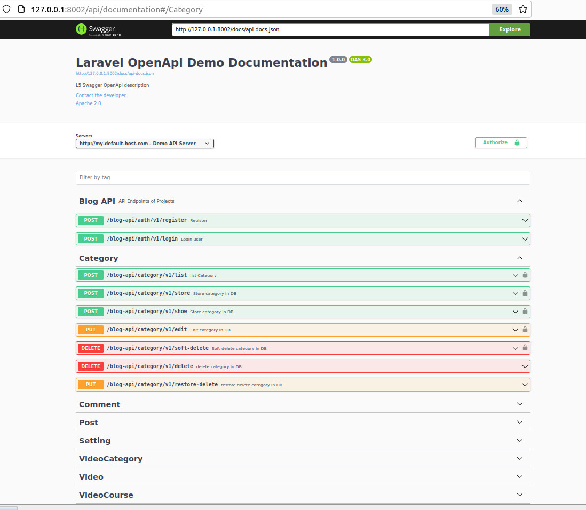
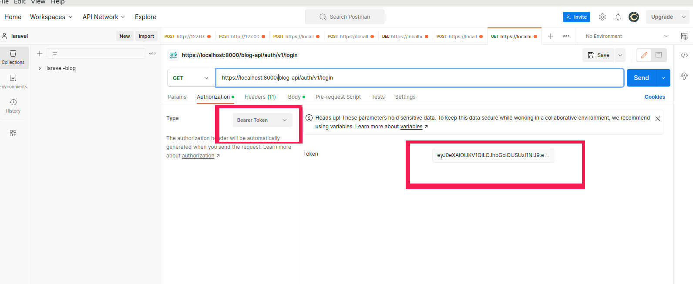

## Laravel Blog Application
This is a Laravel blog application that provides endpoints for blog, category, comment, post, setting, video category, video and video course. It uses Swagger for documentation and testing of the API.
.

## Installation
To install this application, you need to have PHP, Composer, and MySQL installed on your system. Then follow these steps:

Clone the repository and go to the application directory
<pre>
git clone https://github.com/{username}/{repository-name}.git
cd {application-directory}
</pre>
Generate the .env file and configure it according to your database settings
<pre>
cp .env.example .env
</pre>
Install the dependencies
<pre>
composer install
</pre>
Run the migrations and seeders
<pre>
php artisan migrate --seed
</pre>
Start the development server
<pre>php artisan serve</pre>

## Usage

To use this application, you can access the web interface at http://localhost:8000 or use the API endpoints with a tool like Postman or curl. The API documentation is available at http://localhost:8000/api/documentation.

##Authentication
To use the API endpoints, you need to have a valid token. To get a token, you need to register a user and then authenticate with the user credentials.
###1:Register a user
To register a user, you need to send a POST request to <code>/blog-api/auth/v1/register</code> with the following JSON body:
<pre>
{
  "name": "admin",
  "email": "test@,test.com",
  "password": "123456"
}
</pre>
The response will be a JSON object with the user id and email.

###1-2:Authenticate a user
To authenticate a user, you need to send a POST request to <code>https://localhost:8000/blog-api/auth/v1/login</code> with the following JSON body:
<pre>
{
  "email": "test@,test.com",
  "password": "123456"
}
</pre>
The response will be a JSON object with the token and its expiration time.

###1-3: Use the token

To use the token, you need to add it as a Bearer token in the Authorization header of your requests. For example, if you want to use Postman, you can do the following:
<ul>
<li>In the Authorization tab, select Bearer Token as the type.</li>
<li>Paste the token in the Token field.</li>
<li>Send your request to the desired endpoint.</li>
</ul>

## Contribution

If you want to contribute to this project, you can fork the repository, make your changes, and submit a pull request. Please follow the coding standards and write clear commit messages. You can also report any issues or suggest any features on the GitHub issue tracker.
